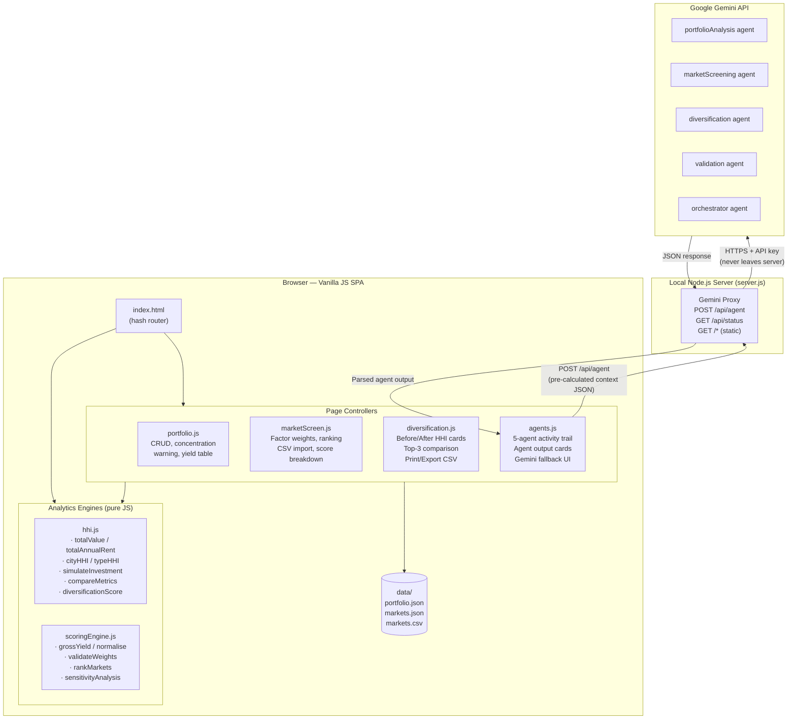

# System Architecture — REIT Target AI

**NMIMS B.Sc. Finance | BA Project Theme 4 | Academic Demo**

---

## Overview

REIT Target AI is a single-page web application that demonstrates a **multi-agent AI workflow** for academic purposes. Deterministic JavaScript engines perform all financial calculations; Gemini provides natural-language interpretation of those results.

---

## Architecture diagram



---

## Component responsibilities

### Analytics engines (`js/hhi.js`, `js/scoringEngine.js`)

Both files use the dual-export pattern — they work as CommonJS modules (for Node.js tests) and as browser globals (for the SPA):

```javascript
if (typeof module !== "undefined" && module.exports) {
  module.exports = HHIEngine;   // CommonJS
} else {
  root.HHIEngine = HHIEngine;   // browser global
}
```

They are **pure functions** with no DOM access, no fetch calls, and no side effects. All financial logic lives here and is covered by the automated test suite.

**Key formulas:**

| Formula | Code location |
|---------|--------------|
| Gross yield = (monthly rent × 12) / capital value per sq ft | `scoringEngine.js: grossYield()` |
| HHI = Σ (shareᵢ)² | `hhi.js: computeHHI()` |
| Min-max normalise to [0, 100] | `scoringEngine.js: normalise()` |
| Risk inversion: lowRiskScore = 100 − riskScore | `scoringEngine.js: scoreMarket()` |
| Weighted total score = Σ (normalisedFactorᵢ × weightᵢ) × 100 | `scoringEngine.js: scoreMarket()` |
| Diversification score (city benefit 60% + type benefit 40%) | `hhi.js: diversificationScore()` |
| Post-investment yield = newAnnualRent / investmentRs = grossYield | `hhi.js: simulateInvestment()` |

### Page controllers

Each controller is an IIFE that renders into a named `<div>` in `index.html`. They never manipulate each other's DOM regions.

| Controller | Root div ID | Data dependencies |
|------------|-------------|-------------------|
| `portfolio.js` | `portfolio-content` | `data/portfolio.json` |
| `marketScreen.js` | `screener-content` | `data/markets.json`, `data/portfolio.json` |
| `diversification.js` | `hhi-content` | reads localStorage set by screener |
| `agents.js` | `agents-content` | reads localStorage set by screener; calls `/api/agent` |

### Server (`server/server.js`)

- Zero npm dependencies — uses only Node.js stdlib (`http`, `https`, `fs`, `path`, `url`)
- Reads `GEMINI_API_KEY` from `server/.env` at startup; key never reaches the browser
- All five agent system prompts are defined here
- Instructs Gemini to respond with `application/json` only
- Returns HTTP 503 if Gemini is unavailable; client shows "AI explanation unavailable"

---

## Data flow for Agent Output page

```
1. marketScreen.js stores ranked results + weights + HHI values in shared ReitState (localStorage)
2. agents.js reads ReitState to build analytical context (portfolioCtx)
3. agents.js calls hhi.js + scoringEngine.js to pre-calculate all metrics (if stale, recalculates)
4. User clicks "Run Agent Analysis" — sequential agent execution begins:
     Portfolio Analysis → Market Screening → Diversification → Validation → Investment Orchestrator
5. For each step: agents.js POSTs { agentType, context } to /api/agent
6. server.js prepends Gemini system prompt; calls Gemini API
7. Gemini returns structured JSON analysis; server.js forwards to browser
8. agents.js renders field-by-field on each agent's result card
9. Validation Agent checks: weightCheck, scoreRangeCheck, targetExists, hhiConsistency
10. Orchestrator ONLY runs if Validation returns validatedOk=true
```

If step 6 fails: steps 1–5 are still shown; step 8 shows "AI explanation unavailable".
If Validation fails (validatedOk=false): Orchestrator step is marked Failed and skipped.

### Shared state schema (localStorage key: `reit_analysis_state`)

| Field | Written by | Read by | Description |
|-------|-----------|---------|-------------|
| `runId` | marketScreen.js | agents.js | UUID for the run |
| `stale` | marketScreen.js | diversification.js, agents.js | True if weights/investment changed since last run |
| `weights` | marketScreen.js | agents.js | Five factor weights (must sum to 1.0) |
| `weightPreset` | marketScreen.js | agents.js | "balanced", "incomeFocused", etc. |
| `investmentCr` | marketScreen.js | diversification.js, agents.js | Investment amount in crore |
| `selectedTargetId` | marketScreen.js | agents.js | marketId of top-ranked market |
| `ranked` | marketScreen.js | agents.js | Full ranked market array with scores |
| `cityHHIBefore` / `cityHHIAfter` | marketScreen.js | diversification.js, agents.js | HHI before/after for city dimension |
| `typeHHIBefore` / `typeHHIAfter` | marketScreen.js | diversification.js, agents.js | HHI before/after for asset-type dimension |

---

## Security design

| Concern | Mitigation |
|---------|-----------|
| API key exposure | Key only in server/.env; never in JS bundle; .env in .gitignore |
| XSS from user-entered text | All insertions use `textContent`, never `innerHTML` |
| Path traversal in static server | `safePath.indexOf(PUBLIC_DIR) !== 0` check |
| Data injection in Gemini prompt | Context JSON is pre-validated by deterministic engines before being sent |
| Production data isolation | REIT project is completely separate from any production application |

---

## Technology choices

| Decision | Rationale |
|----------|-----------|
| Vanilla JS, no build step | Eliminates build toolchain as a source of errors; runs anywhere Node.js is installed |
| ES5 syntax (`var`, not `const/let`) | Avoids transpiler requirements; matches existing codebase style |
| Hash-based routing (`#portfolio`) | No server-side routing needed; works from `file://` or HTTP |
| Pure functions in engines | Enables unit testing without a browser or test framework |
| `textContent` everywhere | XSS-safe by construction; no sanitisation library needed |
| `localStorage` for cross-page state | Market selection persists across navigation without a backend |
| Node.js stdlib-only proxy | Zero supply-chain risk; no npm audit needed |
| Gemini `responseMimeType: "application/json"` | Forces structured output; eliminates markdown-wrapping edge cases |

---

*NMIMS B.Sc. Finance | Business Analytics Project Theme 4 | September 2026 | Academic demonstration only*
