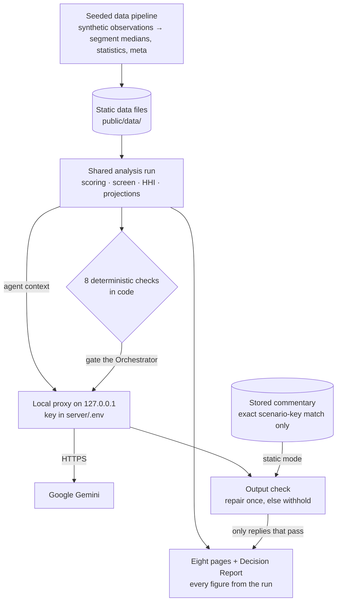
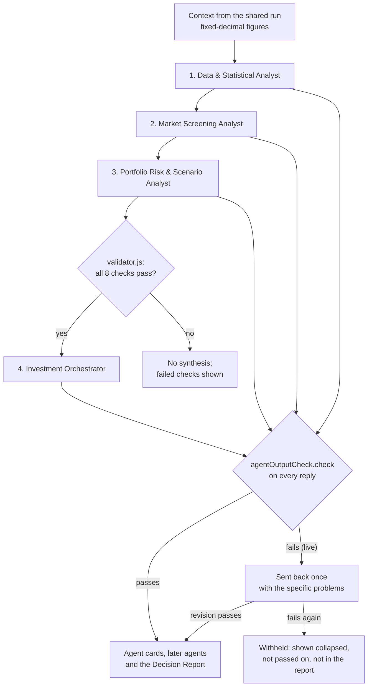
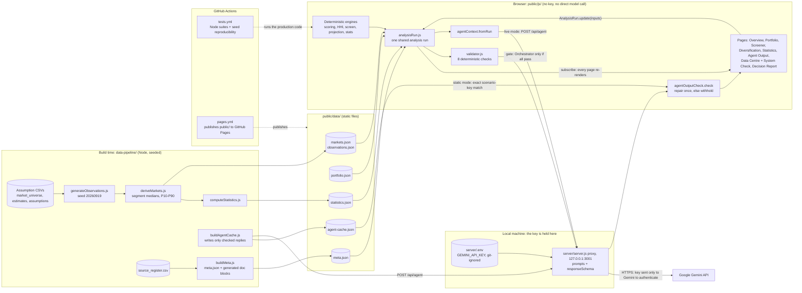

# System Architecture — REIT Target AI

**NMIMS B.Sc. Finance | Business Analytics | Theme 4 — Building Agents/Artifacts Using Generative AI**
**Author: Vishesh Jain | Academic demonstration — all data synthetic**

This document describes the system as it is now. File and function names refer
to the repository; where this document and the code disagree, the code is right.

---

## 1. Overview

REIT Target AI is a single-page browser application (vanilla JavaScript, hash
routing, no build step) with an optional local Node proxy for Gemini. The layers
are:

1. a seeded **data pipeline** that generates the synthetic data at build time;
2. **data files** in `public/data/`, loaded by the browser;
3. pure, deterministic **engines** that score, screen, simulate and project;
4. **one shared analysis run** (`public/js/analysisRun.js`) computed from the
   user's inputs, which every page renders;
5. **page controllers**, one per route, that display the run and send input
   changes back to it;
6. an **agent layer** in which four Gemini agents interpret a context built from
   the run, gated by deterministic checks and followed by a deterministic output
   check;
7. a **System Check** and automated **tests** that exercise the production code.

No model output ever feeds back into a score, a rank, a target or a figure.

<!-- canonical:BEGIN key-figures -->
| Fact | Value |
|---|---|
| Market segments | 50 across 8 cities and 3 property types |
| Simulated market observations | 2,156 (26–76 per segment) |
| Sample portfolio | 10 holdings, ₹500.00 Cr value, ₹33.275 Cr annual rent, 6.655% weighted gross yield |
| Default investment | ₹50.00 Cr (10% of the sample portfolio) |
| Gemini agents | 4 (Data & Statistical Analyst; Market Screening Analyst; Portfolio Risk & Scenario Analyst; Investment Orchestrator) |
| Weight presets | 4 (Balanced, Income Focused, Growth Focused, Diversification Focused) |
| Simulation-support screen | at least 30 simulated observations and Assumption Support Grade C or better — 25 of 50 segments pass |
| External calibration | 0 of 12 cited external sources verified; all 50 segments Unverified |
| Known synthetic anomalies | 24 (1.113% of observations) |
| Generator / seed / data as of | 2.0.0 / 20260919 / 2026-09-19 |
| Institution and author | NMIMS B.Sc. Finance, Business Analytics — Vishesh Jain |
<!-- canonical:END key-figures -->

### 1.1 System overview

A simplified view, readable at ordinary print size. The full diagram, with every
script and data file, is Appendix A. The API key is held on the local machine by
the proxy, which sends it to Google's Gemini endpoint to authenticate each call;
it never reaches the browser.

### 1.2 Agent flow

Each agent receives the context plus the earlier agents' outputs — but only
outputs that passed the check; a withheld reply is replaced by `null`. In static
mode the same check runs on the stored replies before they are displayed (they
all passed when the cache was built; one that failed now would be withheld, since
no repair is possible offline). A live call that fails is reported as "fresh
generation was unavailable"; stored commentary is never substituted for it.

---

## 2. Data pipeline and data files

All data is synthetic and seeded; the same commands reproduce byte-identical
output, and CI asserts this for the generator.

| Script (`data-pipeline/scripts/`) | Reads | Writes |
|---|---|---|
| `generateObservations.js` | `market_universe.csv`, `market_estimates_long.csv` | `data-pipeline/generated/observations.v2.json`, `outlier_truth.json` (the known synthetic anomalies), CSV copies |
| `deriveMarkets.js` | generated observations | `public/data/markets.json` (one row per segment: the **median** of its simulated observations, with observation count and P10–P90 spread), `public/data/observations.json` |
| `computeStatistics.js` | generated observations, anomaly ground truth | `public/data/statistics.json` (descriptives, correlations, regression, detector results) |
| `buildObservationDistribution.js` | `observations.json`, `markets.json` | `public/data/observation-distribution.json` (per-segment distributions for the Screener) |
| `buildMeta.js` | the data files, `source_register.csv`, `analysisRun.js` | `public/data/meta.json`, `docs/CANONICAL_FACTS.md`, and the generated blocks in the documents listed in `canonicalBlocks.js` |
| `buildAgentCache.js` | the data files, the running proxy | `public/data/agent-cache.json` |
| `auditAnalytics.js` | the data files | `data-pipeline/docs/ANALYTICS_AUDIT.md`; exit code 1 if an independent re-derivation disagrees with the engines |

`public/data/portfolio.json` holds the sample portfolio. A legacy `markets.csv` from an
earlier dataset revision, which no code read, was moved to
`archive/retired-public-data-20261004/` so it no longer deploys.

`buildMeta.js` derives every count with `AppMeta.derive()` and computes each
preset's result with the same `AnalysisRun.compute()` the browser uses, so the
generated documentation states exactly what the application displays. External
calibration outcomes come only from the `verification_status` column of the
source register.

---

## 3. Deterministic engines

Every module below works without the DOM or the network and is exported both as
a browser global and as a CommonJS module, so the Node tests and the build
scripts run the production code. All except `dataCleaner.js` (which stamps an
import date on CSV rows that lack one) are also free of clock reads, so the same
inputs always give the same output.

| Module | Responsibility |
|---|---|
| `scoringEngine.js` | Gross yield = monthly rent × 12 ÷ capital value. Min-max normalisation of each factor to 0–100; risk inverted (low market risk = 100 − risk score). Composite score = Σ normalised factor × weight. `validateWeights`, `rankMarkets` (descending score, ties broken by market ID), the four `PRESETS`. |
| `hhi.js` | City and asset-type HHI (Σ share²) on book value; `simulateInvestment` (before and after adding the target at its gross yield); `diversificationScore` (city benefit weighted 0.6, property-type benefit 0.4), which supplies the diversification factor. |
| `governance.js` | The simulation-support screen. `evaluate` returns the two component tests separately (simulated observations; Assumption Support Grade) with exact reasons and `failsOn`; `evidenceTier` gives the simulation-support level (High, Moderate, Limited, Low); `chooseTarget` returns the shortlist candidate, the highest raw-score market and the segments that outrank the candidate but fail; `externalCalibration` reads the register outcomes. It never changes a score or reorders a row. |
| `appMeta.js` | Labels typed once: project identity, the screen rule and its rationale (`GOVERNANCE`), `SUPPORT_GRADES`, `EXTERNAL_CALIBRATION` and `calibrationStatus`, the controlled glossary (`TERMS`), `RETIRED_TERMS`, the candidate caveat, and the agent roster (`AGENTS`). |
| `projection.js` | Conservative, base and optimistic scenarios, each with constant annual rental growth, capital growth and occupancy, projected over 1, 3 and 5 years from a year-0 position that includes the investment; no leverage, tax, fees or transaction costs. |
| `stats.js` | Descriptive statistics and seeded bootstrap median intervals. For city × property-type groups the interval unit is the micro-market (segment median), not the observation; a group with too few micro-markets gets no interval and a stated reason. |
| `validator.js` | Eight deterministic checks on the run: weights total 100%, composite scores within 0–100, ranking in descending order, selected target present, portfolio HHI reproduces, weighted yield equals rent ÷ value, investment amount positive and finite, synthetic-data notice present in the context. Also the fixed list of stated limitations. |
| `filters.js` | Screener display filters. They hide rows; they never rescore or re-rank. |
| `scenarioKey.js` | Canonical identity of a run for the agent cache (section 6.6). |
| `dataCleaner.js` | CSV parsing and cleaning for the Data Centre import (`parseCSV`, `cleanRecords`). |

---

## 4. The shared analysis run (`analysisRun.js`)

### 4.1 Inputs

The run is a function of persisted **inputs** and loaded **data**:

| Inputs (persisted) | Data (loaded once) |
|---|---|
| preset, exact weights (custom weights are kept only if they sum to 100%), investment amount (default: 10% of the active portfolio's value), screen override, selection mode, manual target, display filters | `markets.json`, the active portfolio (sample, or the custom portfolio when the user has chosen it and it is non-empty), `statistics.json`, the source-verification outcomes in `meta.json` |

`stateManager.js` stores only the inputs, under application-owned keys:
`reit_analysis_state` (inputs, schema 2), `reit_portfolio_mode` and
`reit_custom_portfolio`. The analysis itself is never stored.

### 4.2 What `compute(inputs, data)` produces

`AnalysisRun.compute()` is pure and runs identically in the browser, in the
tests and in the build scripts. It returns:

- the full ranking, each segment carrying its raw rank, eligible rank (or none),
  screen result and reasons, simulation-support level, external calibration
  status and its HHI simulation for the chosen amount;
- `highestRawScoreMarketId`, `recommendedCandidateId` (the shortlist candidate,
  or the highest raw-score market when the screen is explicitly ignored),
  `selectedTargetId`, `selectionMode`, and whether selection and candidate differ;
- portfolio summary and fingerprint, dataset fingerprint;
- `hhi` (city and asset-type HHI and weighted yield, before and after) and
  `projections` for the selected target;
- `sensitivity`: for each of the four presets, both the highest raw-score market
  and the screen's candidate, so an ineligible segment is never presented as a
  preset's result;
- `scenarioDescriptor` and `scenarioKey`;
- `agentContext` (from `AgentContext.fromRun`) and `validation` (from
  `Validator.validate`).

Read helpers used by every page: `selected`, `recommended`, `rawLeader`,
`rawTop`, `eligibleTop`, `targetLabel`, `comparison` (the highest raw-score
alternative when it is a different segment, otherwise the next eligible
candidate) and `digest` (the figures the acceptance tests compare across pages).

### 4.3 Controller API (browser only)

| Call | Effect |
|---|---|
| `ready()` | Loads the data once, normalises the stored inputs, computes the first run. |
| `current()` | The run in memory. |
| `update(patch)` | Merges an input change, persists the inputs, recomputes, notifies every subscriber. |
| `selectManually(id)` / `returnToAuto()` | Switch selection mode through `update`. |
| `portfolioChanged()` | Recompute after the Portfolio page changes holdings or mode. |
| `reset()` | Reset Demo (section 4.5). |
| `subscribe(fn)` | Called after every recompute; returns an unsubscribe function. |

### 4.4 Selection modes

- **auto** — the selected target is the shortlist candidate and moves with every
  change of preset, weights, amount, portfolio or screen setting.
- **manual** — the user's chosen segment stays selected across changes and is
  labelled "Manually selected target" on every page; when it differs from the
  current candidate, the pages say so and offer "Return to automatic
  recommendation". HHI, projections and the agent context follow the manual
  target. If the chosen segment no longer exists in the dataset, the run falls
  back to automatic selection.

### 4.5 Reset Demo

The Overview shows an explicit confirmation panel (Reset to defaults / Cancel).
`AnalysisRun.reset()` calls `ReitState.resetApp()`, which clears only the
application's input key and returns the portfolio mode to the sample — the
custom portfolio is user work and is kept, only made inactive. Inputs return to
the defaults (Balanced, its canonical weights, the default amount, screen
applied, automatic selection, no filters), the run is recomputed at once, and the
user is returned to the Overview with a valid analysis.

### 4.6 Root cause of the cross-page synchronisation defect

**Symptom.** After the preset was changed on the Market Screener, the Overview,
Agent Output and the Decision Report described the new target while
Diversification continued to analyse the previous one; its HHI figures, Top 3
and projections still reflected the earlier preset.

**Cause.** There was no single analysis. The Market Screener computed a snapshot
(ranking, target, HHI figures) and wrote it to `localStorage`, and every other
page read that snapshot at a moment of its own choosing. Diversification read it
once, when the application loaded, so it never saw a later write. No single page
computed anything wrong; the pages held different copies of the analysis taken at
different times.

**Fix.** The defect was removed structurally rather than patched page by page.
Only inputs are persisted; the run is recomputed from them in one place, held in
memory, and pushed to every subscribed page in the same tick. No page computes a
target, an HHI figure or a projection of its own. The application tests assert
this for each controller (each renders the run, subscribes to it, and contains no
call to `Governance.chooseTarget`, `ScoringEngine.rankMarkets` or
`ReitState.load()`) and check, for all four presets, that the selected target,
HHI, projections, agent context, validation and scenario key describe the same
segment.

---

## 5. Page controllers

Each controller renders into its own section of `index.html`, builds the DOM with
`textContent`, and reads the shared run; none computes a target.

| Route | Controller | Relationship to the run |
|---|---|---|
| `#overview` | `overview.js` | Renders the run: current analysis, comparison segment, limits; hosts Reset Demo and "Return to automatic recommendation". |
| `#portfolio` | `portfolio.js` | Shows the read-only sample portfolio or edits the custom one (stored through `ReitState`), then calls `AnalysisRun.portfolioChanged()`; subscribes so a reset is reflected. |
| `#screener` | `marketScreen.js` | Renders the ranking; every control (preset, sliders, amount, screen override, filters, manual selection) calls `AnalysisRun.update()`; loads `observation-distribution.json` for per-segment distributions. |
| `#diversification` | `diversification.js` | Renders HHI before/after, raw-score and eligible-shortlist tables (`rawTop`, `eligibleTop`), `run.sensitivity` and projections. |
| `#agents` | `agents.js` | Renders `run.agentContext` and `run.validation`; runs the agent chain (section 6). |
| `#datacentre` | `dataCentre.js` | The five data levels, CSV import through `dataCleaner.js`, city × property-type statistics, and the System Check run against the current run. |
| `#statsdash` | `statsDashboard.js` | Renders `statistics.json`: dataset-level statistics that do not depend on the run's inputs. |
| `#report` | `report.js` | Renders the run as a printable report: raw-score Top 3 and eligible-shortlist tables, model candidate versus manual target, HHI and projections; prints agent commentary only when its scenario key equals the run's. |

---

## 6. Agent layer

### 6.1 Roster and order

The roster is `AppMeta.AGENTS`; the prompts are in `server/server.js`.

| Order | Agent | Interprets |
|---|---|---|
| 1 | Data & Statistical Analyst (`dataStatistical`) | The market-segment dataset: simulation support by city, dispersion, segment-median outliers, the known synthetic anomalies. |
| 2 | Market Screening Analyst (`marketScreening`) | Why the selected target scored as it did, its dominant factor, the comparison segment, and the screen outcome for higher-scoring segments. |
| 3 | Portfolio Risk & Scenario Analyst (`portfolioRisk`) | The HHI change, weighted yield before and after, and the scenario projections. |
| — | `validator.js` | Eight deterministic checks. No model call. |
| 4 | Investment Orchestrator (`orchestrator`) | A synthesis of the three analyses. Called only when every deterministic check passes. |

Each later agent receives the earlier agents' outputs alongside the context, and
the Orchestrator also receives the validation result. Validation was once a model
call; it is now code because every question it asks has one arithmetic answer.
The proxy refuses a request for the retired validation agent (HTTP 410).

### 6.2 Context: `AgentContext.fromRun(run, data)`

The context is built deterministically from the run, so the figures the agents
see are the figures every page displays. It carries explicit fields —
`rawRank`, `eligibleRank`, `highestRawScoreMarket`, `recommendedCandidate`,
`selectedTarget`, `selectionMode`, `passesSimulationSupportRule`,
`externalCalibrationStatus`, `simulationObservationCount`, `supportGrade`,
`largestContribution`, `exclusionReasons` / `failsScreenOn`, the comparison
segment with its role, the raw top five, the eligible top three, and the segments
that score above the target but fail the screen. Every figure the models may
quote is a fixed-decimal string at display precision, because a JSON number
loses trailing zeros and the model would otherwise round what it quotes. Dataset
figures are scoped explicitly as the market-segment dataset, never the
portfolio, and the context includes the controlled terminology and the words not
to use.

### 6.3 Strict response schemas

`AgentOutputCheck.SCHEMAS` defines, for each agent, an object of required prose
fields (strings or lists of strings) and nothing else — no number fields a model
could fill inconsistently. The proxy passes the schema to Gemini as
`generationConfig.responseSchema`; the same definition is used by the cache
builder and the browser check.

### 6.4 Output check: `AgentOutputCheck.check(agentKey, output, ctx, universe)`

Run on every reply, live or stored. It flags: missing or extra fields; markets
that do not exist or are not in the context; rank claims that do not match raw or
eligible rank; figures that match nothing in the context at the stated precision
(a percentage matches only a percentage figure); exclusion reasons attributed to
the wrong test, or to a segment that passes; wrong counts of segments passing or
failing the screen; a dominant factor other than the largest contribution;
retired terminology (`AppMeta.RETIRED_TERMS`) and evidence or statistical
overclaims; dataset figures described as the portfolio's; context field names
leaking into prose; a target called manually selected in automatic mode; and, for
the Orchestrator, a summary that does not name the selected target or next steps
that do not state that calibration is unverified and due diligence is required.
It cannot prove prose true; it proves specific kinds of statement false.

### 6.5 Server proxy (`server/server.js`)

Node standard library only. Routes: `POST /api/agent` (one agent call; used by
the page and the cache builder), `POST /api/agents/analyse` (a server-side
four-agent chain with the same deterministic gate; the page does not use it),
`GET /api/health` and `GET /api/status` (report whether a key is configured, as a
boolean), `/api/cache/clear`, and static files from `public/` with a
path-traversal check. It listens on 127.0.0.1 by default; `REIT_HOST=0.0.0.0`
makes it reachable from the network, deliberately. The default model is
`gemini-3.1-flash-lite`, the same as `.env.example`. The key is read from
`server/.env` and sent only to the Gemini endpoint, to authenticate each call. Each call requests JSON output with the agent's
`responseSchema`, temperature 0.2 and thinking disabled; transient errors are
retried with exponential backoff; when a model's quota is exhausted, or the model
is unusable (HTTP 400/404), the call moves to the next model in the chain
(`GEMINI_MODEL`, then `GEMINI_FALLBACK_MODELS`). Replies are cached in memory by
agent and context hash. Legacy agent names from the earlier design are mapped to
the agent that absorbed their role.

### 6.6 Live mode, static mode and the scenario-keyed cache

- **Live mode** applies only when the page is served by the proxy itself
  (`node server/server.js`, http://localhost:3001). The page probes
  `/api/health` and, if a key is configured, "Run Agent Analysis" makes live
  calls for the current run (the Orchestrator only when the checks pass). If the
  proxy has no key, the pre-generated commentary below is still available.
- **Public site.** On any host other than `localhost` (GitHub Pages),
  `public/js/siteMode.js` removes the Agent Output link and page before the
  router starts, the Overview lists the page as "local copy only", and the
  Decision Report says the public site has no AI commentary. Nothing is fetched
  from the proxy or the cache. `?publicSite=1` forces this on a local copy.
- **Static mode** applies on a local copy served without the proxy (for example
  `python3 -m http.server`). The proxy is not
  probed, so no failed requests are logged. "Show Pre-generated Analysis" serves
  `public/data/agent-cache.json` only when the run's scenario key matches a
  stored scenario exactly; the button then reads "Hide Pre-generated Analysis".
  Otherwise the button is disabled and the page lists the inputs that differ
  (`ScenarioKey.diff`).
- **Scenario key** (`scenarioKey.js`): a hash of the dataset fingerprint,
  portfolio fingerprint, weights, investment amount, selected target, selection
  mode, screen override, shortlist candidate, top-five ranking with scores,
  methodology version and agent context version.
- **Cache contents**: one scenario per preset at the canonical defaults (sample
  portfolio, default amount, screen applied, automatic selection), four agents
  each, built by `buildAgentCache.js` from the same `analysisRun.js`. Every reply
  passed `AgentOutputCheck.check()` before being written; a failing reply is sent
  back with its specific problems (`revisionNotes`) up to two times, and nothing
  is written unless every reply for every preset passes.

On screen, each card states its provenance (live, pre-generated, or
deterministic only), shows headline figures taken from the context rather than
the prose, and shows its check result. When the run changes, results produced for
the previous run are discarded; the Decision Report includes commentary only for
the exact run it was produced for.

---

## 7. External data connectors

No external data connector is implemented. Every figure comes from the seeded
generator in `data-pipeline/`, and the Data Centre states that all data is
synthetic, with no live feed or external database connection.

A production connector would have to sit at the start of the pipeline, not in
the browser: it would write observation-level records in the generator's schema,
after which `deriveMarkets.js`, `computeStatistics.js`,
`buildObservationDistribution.js` and `buildMeta.js` would run unchanged. External
calibration would change only through the source register: a segment becomes
Partially supported or Verified only when its cited sources are located and their
figures traced, as recorded in `data-pipeline/source_register.csv`. Any change to
the dataset changes the dataset fingerprint and therefore every scenario key, so
stored agent commentary would stop matching until `buildAgentCache.js` is run
again. Credentials for a data provider would belong in `server/.env`, never in
`public/`.

---

## 8. System Check (`systemCheck.js`)

A pure module run from the Data Centre ("Run System Check") against the current
run and data, and by the application tests in Node. Each check reports what it
expected and what it got, in the application's units.

| Check | What it exercises |
|---|---|
| CHK-01 | City and asset-type HHI with the production asset fields |
| CHK-02 | Scoring engine ranks every segment with valid weights |
| CHK-03 | Projection engine's year-0 position |
| CHK-04 | CSV cleaning accepts a valid row and rejects an impossible one, with a reason |
| CHK-05 | The shared run is consistent (target present, HHI equals its simulation, scenario key reproduces) and storage round-trips on a separate probe key, which is removed |
| CHK-06 | Market dataset matches the counts in `meta.json` |
| CHK-07 | Sample portfolio matches the figures in `meta.json` |
| CHK-08 | HHI before and after a simulated investment |
| CHK-09 | All four presets have five factors totalling 100% |
| CHK-10 | `agent-cache.json` is in the current format: one scenario per preset, each stored under the key its descriptor hashes to, at the current context version |

The System Check never writes the analysis-input key.

---

## 9. Tests and CI

- `node tests/reit-tests.js` — the application suite, in Node with no browser.
  Among other things it covers the engines, the screen (no score or rank
  changes), cross-page synchronisation for all four presets, automatic and manual
  selection, Reset Demo, the Decision Report tables, the agent context and output
  check, the agent cache, the System Check, and documentation synchronisation:
  documents carry generated blocks and the test suite fails if a block, a parsed
  figure or a retired term is out of date.
- `node data-pipeline/tests/dataPipeline.test.js` — the data pipeline suite.
- `node data-pipeline/scripts/auditAnalytics.js` — independent re-derivation of
  the headline figures; exit code 0 when it agrees with the engines.
- `tests/browserAcceptance.js` — acceptance checks run inside the application:
  they drive the pages through their own controls (presets, manual selection,
  Reset Demo, pre-generated analysis, System Check, CSV import) and compare what
  each of the eight routes shows. `tests/browserSmokeTest.js` is a Playwright
  check that every route renders without console errors. Both run locally.
- CI: `.github/workflows/tests.yml` runs the two Node suites and a
  reproducibility check (regenerating the observations from the fixed seed must
  reproduce the committed file byte for byte); `.github/workflows/pages.yml`
  deploys `public/` to GitHub Pages.

Test counts are reported by each run and in [test-report.md](test-report.md).

---

## 10. Security design

| Concern | Mitigation |
|---|---|
| API key exposure | The key lives only in `server/.env` (git-ignored with every `server/.env.*` variant) and is sent only to the Gemini endpoint; health routes report a boolean. |
| Cross-site scripting | User-supplied text is inserted with `textContent`; a test fails on any non-empty `innerHTML` assignment outside `charts.js`, which injects generated SVG. |
| Path traversal | The static server refuses any path that resolves outside `public/`. |
| Model output treated as fact | Figures are rendered from the deterministic context; every reply is checked; the Orchestrator is gated by code. |
| Other data in the browser | Reset Demo removes only the application's own keys, never `localStorage.clear()`. |

---

## 11. Technology choices

| Decision | Rationale |
|---|---|
| Vanilla JavaScript, no build step | Nothing to install; the same files run in the browser and in Node. |
| Pure engines with dual export | Unit-testable without a browser; build scripts reuse the production code. |
| One in-memory run, inputs persisted | Pages cannot hold different copies of the analysis. |
| Hash routing | Works on any static host, including GitHub Pages. |
| Node standard-library proxy | No third-party packages to install, audit or keep patched (the project's own code can still contain defects); the key never reaches the browser. |
| Strict response schemas plus a deterministic check | The model is held to prose fields, and specific false statements are caught before display. |

---

## Appendix A — Detailed system diagram

Every script, data file and route, with the CI actions dashed. Full-size PNG and
SVG exports are in the submission package.

---

*NMIMS B.Sc. Finance | Business Analytics | Theme 4 — Vishesh Jain | Academic demonstration only*
