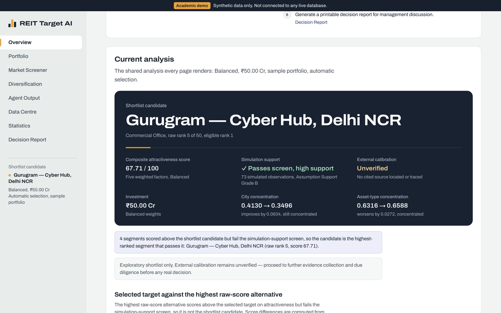
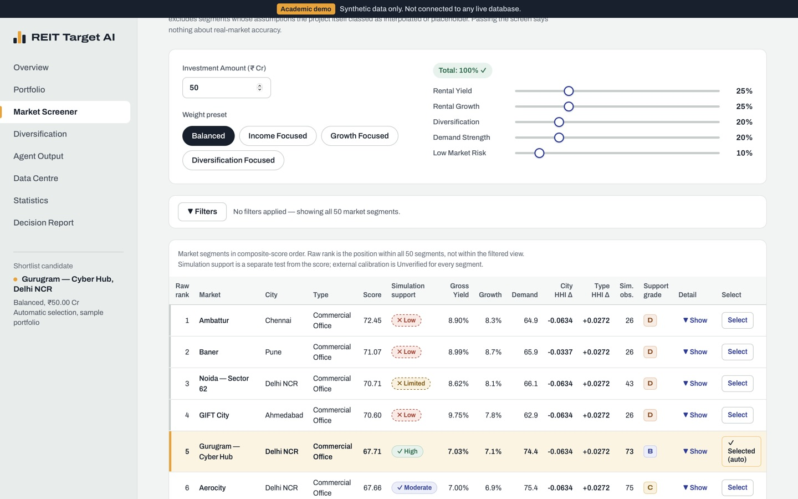

# REIT Target AI

## Decision support for REIT target-market selection, with deterministic analytics and checked generative-AI interpretation

| | |
|---|---|
| Author | Vishesh Jain |
| Institution | NMIMS — B.Sc. Finance |
| Course | Business Analytics |
| Theme | Theme 4 — Building Agents/Artifacts Using Generative AI |
| Date | 5 October 2026 |
| Repository | https://github.com/visheshjain0603-design/reit-target-ai |
| Live site | https://visheshjain0603-design.github.io/reit-target-ai/ |

*Academic demonstration. All data is synthetic. Nothing in this report describes a real property, tenant, transaction or market, and nothing in it is investment advice.*

---

## Contents

1. Executive summary
2. Primary customer and business problem
3. Project objectives
4. Detailed use cases
5. Scope and exclusions
6. Data methodology
7. Dataset structure and provenance
8. Model selection and justification
9. Scoring: formula, normalisation and risk inversion
10. Concentration: HHI methodology
11. The simulation-support screen and external calibration
12. Scenario methodology
13. Statistical analysis
14. Agent architecture
15. Prompt design
16. Deterministic validation and output checking
17. Results under the four presets
18. Testing and reproducibility
19. Live-demonstration procedure
20. Limitations
21. AI-use declaration
22. Conclusion
23. References
24. Appendix A — Formulas
25. Appendix B — Key field definitions

---

## 1. Executive summary

REIT Target AI is a browser application that helps a real estate investment trust (REIT) decide where a proposed new investment should go. For a sample portfolio it ranks a universe of candidate market segments on five business factors, shows how the investment would change the portfolio's geographic and asset-type concentration, projects the result under three scenarios, and asks four Gemini agents to explain the outcome in plain English. A printable Decision Report records the whole analysis for management discussion.

The design rests on one division of labour: **deterministic code calculates; the language model only interprets.** Every score, rank, screen outcome, concentration figure and projection is computed in JavaScript from the data files. The agents receive those figures as a fixed context, may not introduce figures of their own, and every reply is checked against that context before it is shown. Validation of the inputs is arithmetic and is done in code before the final agent is called.

Three ideas are kept strictly apart throughout the application, because confusing them would overstate what the tool knows:

1. the **composite attractiveness score** — five weighted factors, which nothing else changes;
2. **simulation support** — how many simulated market observations stand behind a segment's medians, how wide their spread is, and the project's internal **Assumption Support Grade**; and
3. **external calibration** — whether any cited source was located and a figure traced to it.

The model output is a **shortlist candidate**: the highest-ranked candidate passing the simulation-support screen (at least 30 simulated observations and Assumption Support Grade C or better). That screen is a project governance convention for simulation precision, not evidence about the real market. External calibration is Unverified for every segment, because none of the twelve cited external documents could be located. Every candidate therefore carries the same caveat: *exploratory shortlist only; proceed to further evidence collection and due diligence before any real decision.*

All the analysis is held in one shared analysis run (`public/js/analysisRun.js`) that every page renders, so a change made on one page is reflected identically on all of them. The results for each of the four weight presets are generated from the application's own code and appear in Section 17.

<!-- canonical:BEGIN key-figures -->
| Fact | Value |
|---|---|
| Market segments | 50 across 8 cities and 3 property types |
| Simulated market observations | 2,156 (26–76 per segment) |
| Sample portfolio | 10 holdings, ₹500.00 Cr value, ₹33.275 Cr annual rent, 6.655% weighted gross yield |
| Default investment | ₹50.00 Cr (10% of the sample portfolio) |
| Gemini agents | 4 (Data & Statistical Analyst; Market Screening Analyst; Portfolio Risk & Scenario Analyst; Investment Orchestrator) |
| Weight presets | 4 (Balanced, Income Focused, Growth Focused, Diversification Focused) |
| Simulation-support screen | at least 30 simulated observations and Assumption Support Grade C or better — 25 of 50 segments pass |
| External calibration | 0 of 12 cited external sources verified; all 50 segments Unverified |
| Known synthetic anomalies | 24 (1.113% of observations) |
| Generator / seed / data as of | 2.0.0 / 20260919 / 2026-09-19 |
| Institution and author | NMIMS B.Sc. Finance, Business Analytics — Vishesh Jain |
<!-- canonical:END key-figures -->

---

## 2. Primary customer and business problem

<!-- canonical:BEGIN customer-and-use-cases -->
**Primary user.** REIT investment analysts and acquisition committees evaluating where a proposed new investment should be allocated.

**Business problem.** A REIT must balance income, growth, demand, risk and portfolio diversification when choosing its next target market, while understanding the reliability and limitations of the supporting data.

**Core use cases** (and the pages where each is carried out):

1. Diagnose geographic and asset-type concentration in the existing portfolio. *(Portfolio, Diversification)*
2. Rank target markets using adjustable business priorities. *(Market Screener)*
3. Compare the highest raw-score market with the highest-ranked market passing the simulation-support screen. *(Market Screener, Overview)*
4. Simulate yield, concentration and scenario effects of a proposed investment. *(Diversification)*
5. Produce deterministic validation and Gemini-assisted interpretation. *(Agent Output)*
6. Generate a printable decision report for management discussion. *(Decision Report)*
<!-- canonical:END customer-and-use-cases -->

The customer is the investment team of a listed REIT and the acquisition committee it reports to. Their decision is a capital-allocation one: of the markets the REIT could enter, which should receive the next tranche of capital, and what would that choice do to the portfolio? The difficulty is not arithmetic. Income, growth, diversification, demand and risk pull in different directions; a market can look attractive on figures that are thinly supported; and a committee needs the reasoning as well as the ranking. The application addresses each part: a transparent weighted score for the trade-off, a separate screen for how well each segment's figures are supported, a before-and-after view of concentration, and checked plain-language interpretation.

---

## 3. Project objectives

1. **Decision support.** Rank candidate market segments for a new investment on factors an investment committee recognises, with priorities the user can change.
2. **Portfolio awareness.** Measure how a proposed investment would change the existing portfolio's concentration by city and by asset type.
3. **Honest support.** Show, beside every ranking, how well the figures behind it are supported, and never present simulated precision as market evidence.
4. **Checked interpretation.** Use generative AI agents to explain the analysis in plain English without letting them compute, rank or validate, and check every reply against the computed figures.
5. **Consistency and reproducibility.** One analysis shown identically on every page; data regenerated byte for byte from a fixed seed; every documented figure generated from the data.
6. **Demonstrability.** Run live in a browser, respond to evaluator-chosen inputs, and produce a printable decision record.

---

## 4. Detailed use cases

Each use case is listed with its trigger, what the user does, what the system computes, and where the result appears.

| # | Use case | User action | System behaviour | Result shown on |
|---|---|---|---|---|
| 1 | Diagnose concentration in the existing portfolio | Open Portfolio (sample, or build a custom portfolio) | Computes city and asset-type HHI on book value, allocation shares and weighted gross yield | Portfolio; Diversification |
| 2 | Rank target markets using adjustable business priorities | Choose a preset or move the five weight sliders; set the investment amount | Normalises five factors, applies the weights, ranks all segments (raw rank); custom weights are applied only when they total 100% | Market Screener |
| 3 | Compare the highest raw-score market with the highest-ranked market passing the screen | Read the candidate panel; expand a row's score breakdown | Applies the simulation-support screen without changing any score; names the shortlist candidate, the highest raw-score market and the exact reason any higher-scoring segment fails | Market Screener; Overview |
| 4 | Simulate yield, concentration and scenario effects | Open Diversification for the selected target | Adds the investment as one holding in the target's city and type; recomputes HHI and weighted yield; projects 1, 3 and 5 years under three scenarios | Diversification |
| 5 | Deterministic validation and Gemini-assisted interpretation | Open Agent Output; run the agents (live) or show stored commentary (static) | Runs eight arithmetic checks, gates the final agent on them, and checks every agent reply against the computed context | Agent Output |
| 6 | Printable decision report | Open Decision Report; print or save as PDF | Assembles the run, both screening tables, HHI, projections, checks, limitations and commentary for this exact run only | Decision Report |

Two further capabilities support these: **manual selection** (the user can make any segment the selected target; every page labels it and warns when it differs from the shortlist candidate) and **Reset Demo** (restores the canonical defaults). A System Check on the Data Centre page runs ten checks of the production engines in front of an evaluator.

---

## 5. Scope and exclusions

**In scope.** Eight routes — Overview, Portfolio, Market Screener, Diversification, Statistical Analysis, Agent Output, Data Centre and Decision Report; a static deployment on GitHub Pages with stored agent commentary; a local Node proxy for live Gemini calls; a seeded data pipeline; automated and browser acceptance tests.

The Data Centre's CSV import is a cleaning demonstration: it never replaces the analysis dataset, and it reads area units only where they are declared (square feet, or square metres converted once). Replacing the dataset is done through the seeded pipeline, not the interface.

**Excluded, deliberately.**

- Real market data and live data feeds. All data is synthetic and is not scraped or fetched from any external system.
- Net yield: management fees, vacancy allowance, capital expenditure, tax, leverage and transaction costs.
- Market-value (mark-to-market) concentration, tenant and lease-expiry concentration.
- Forecasting. Scenario projections are illustrative what-if paths with flat rates, not forecasts.
- Regulatory review against the SEBI (Real Estate Investment Trusts) Regulations, 2014.
- Any claim that a figure is externally verified.
- Additional agents, statistical tests or markets beyond what the analysis needs.

---

## 6. Data methodology

### 6.1 Why synthetic data

The project's purpose is the method — how deterministic analytics and generative-AI interpretation are combined and checked — rather than a claim about the Indian market. Licensed, observation-level market data was not available, and scraping listing sites would raise accuracy, consent and terms-of-use problems. A seeded synthetic dataset makes the structure of the data inspectable, every figure reproducible, and anomaly detection measurable against a known truth.

### 6.2 How the data is generated

`data-pipeline/scripts/generateObservations.js` (generator version 2.0.0, seed 20260919) produces the simulated market observations. Each observation is one seeded draw for one segment: monthly rent per sq ft, value per sq ft, gross yield, rental growth, capital growth, occupancy, vacancy, demand score and market risk score. It is not a property, listing or transaction.

The data is *assumption-anchored synthetic data*: each segment's lower, central and upper estimates were written as assumptions (`data-pipeline/market_estimates_long.csv`, `data-pipeline/assumptions.csv`), some intended to follow published benchmarks that could not later be located, and the generator draws observations around those assumptions. The generator is built so that the figures cannot contradict one another:

- **Rent is sampled, yield is modelled, value is derived.** Gross yield = base for the property type + adjustment for locality class + adjustment for city tier + noise; value per sq ft = rent × 12 ÷ yield. Prime localities and first-tier cities receive yield compression, so lower yields for prime assets emerge from the construction.
- **Dependence between metrics.** The other metrics are drawn through a Gaussian copula (Cholesky factorisation of a stated correlation matrix) and mapped back through each metric's triangular marginal, so the assumed ranges are preserved.
- **Dispersion by city tier.** First-tier cities have tighter dispersion than third-tier cities.
- **Draws per segment.** Proportional to a liquidity proxy (locality class × city tier, with seeded noise), rescaled to a fixed total, with a minimum of 26 per segment.
- **Known synthetic anomalies.** Anomalies of five kinds (subtle mispricing, distressed sale, trophy asset, data-entry error, and a bivariate-only kind visible only to a multivariate method) are inserted, and their identities are written to a separate ground-truth file (`data-pipeline/generated/outlier_truth.json`) that the detectors never read.

The pseudo-random generator is Mulberry32 with a fixed seed; nothing reads the clock or `Math.random`. Regenerating reproduces the committed output byte for byte, and continuous integration fails if it does not.

### 6.3 From observations to segments

`data-pipeline/scripts/deriveMarkets.js` builds `public/data/markets.json`. Each segment's statistical fields are the **medians** of its simulated observations; `observationCount` is the number of draws; an `uncertainty` block records the **P10, median and P90** of the draws — the values below which 10%, 50% and 90% of the segment's simulated observations fall. The median is used because it is robust to the inserted anomalies. Provenance fields (cited source IDs, assumption IDs, Assumption Support Grade, locality class) are carried through unchanged.

### 6.4 The sample portfolio

`public/data/portfolio.json` holds ten synthetic holdings with book value, annual rent, area, occupancy, lease expiry and tenant sector, in four cities. The user may instead build a custom portfolio on the Portfolio page; while active and non-empty it replaces the sample in every calculation.

---

## 7. Dataset structure and provenance

The data has five levels with different units of analysis. They are kept apart in the Data Centre so that a statistic of one level is never presented as a statistic of another — in particular, statistics of the market segments are not statistics of the portfolio.

| # | Level | File | One row is |
|---|---|---|---|
| 1 | Portfolio holdings | `public/data/portfolio.json` (or the custom portfolio) | one synthetic holding |
| 2 | Market segment aggregates | `public/data/markets.json` | one candidate segment; statistical fields are medians of its simulated observations |
| 3 | Simulated observation dataset | `public/data/observations.json` | one seeded draw for one segment |
| 4 | Source / calibration register | `data-pipeline/source_register.csv`, summarised in `public/data/meta.json` | one cited source and what verification found |
| 5 | Data quality and cleaning | a CSV the user imports; fixtures in `tests/fixtures/` | one imported listing-style row |

**Provenance.** The source register lists twelve external documents the assumptions cite (REIT annual reports, consultancy research and press) and one internal entry, the project's own assumption set. On 4 October 2026 each cited URL was checked. None of the twelve cited documents was located and no figure was traced; the outcome for each is in `docs/SOURCE_VERIFICATION_REPORT.md` and in Section 23. No data value was changed to fit a source. External calibration is therefore Unverified for every segment. A second pass on 5 October 2026 found that every segment's methodology note named publications other than the ones in its `sourceIds` and claimed a calibration that never happened; the notes were rewritten to match the register (originals kept), and fourteen individual assumptions were compared with figures in four related documents that could be read — four consistent, two partly consistent, six below the located figure (Bandra Kurla Complex office rent most clearly), one above and one context only (`data-pipeline/benchmark_checks.csv`). The assumptions remain the authors' own; none was changed to fit. Field definitions and units are in Appendix B and `docs/data-documentation.md`.

---

## 8. Model selection and justification

| Choice | Alternatives considered | Why this choice |
|---|---|---|
| **Weighted multi-factor scoring** | A predictive model (regression, gradient boosting); a single metric such as yield | There is no labelled outcome — no record of which acquisitions succeeded — to train or validate a predictive model, and a committee needs to see and change the priorities. A weighted sum of normalised factors is transparent, explainable factor by factor, and its sensitivity to the weights can be shown directly. |
| **Five factors**: rental yield, rental growth, diversification benefit, demand, low market risk | More factors (capital growth, occupancy) | These are the dimensions an acquisition committee weighs. Capital growth moves closely with rental growth, and occupancy with demand and risk, in the simulated observations, so adding them would count the same information twice. |
| **Min–max normalisation** | z-scores; rank transforms | Puts every factor on a common 0–100 scale whose end points are the best and worst segment, so weights mean "share of the score"; easy to explain and to recompute by hand. |
| **Median aggregation** | Mean of observations | Robust to the inserted anomalies and to skew. |
| **Herfindahl–Hirschman Index** | Count of cities; largest share | A standard, single-number concentration measure that rises with both fewer and more unequal shares, and that can be recomputed before and after an investment. |
| **Simulation-support screen** | No screen; merging support into the score | Keeps attractiveness and support separate, so a committee sees both rather than a blended figure that hides why a segment was excluded. |
| **Deterministic validation** | A "validation agent" (an earlier design) | Every check has one arithmetic answer; code is exact, reproducible, offline and shows its working. |
| **Gemini for interpretation only** | Letting the model rank or recommend | A language model can state wrong figures fluently. Restricting it to interpreting a fixed context makes every figure it quotes checkable. |

---

## 9. Scoring: formula, normalisation and risk inversion

`public/js/scoringEngine.js` scores every valid segment on five factors, each on a 0–100 scale.

| Factor | Raw input | Scaling |
|---|---|---|
| Rental yield | gross yield = median monthly rent × 12 ÷ median value per sq ft | min–max across valid segments |
| Rental growth | median annual rental growth | min–max across valid segments |
| Diversification benefit | the portfolio's existing share in the segment's city and property type | formula below, already 0–100 |
| Demand | median demand score | min–max across valid segments |
| Low market risk | 100 − median risk score | fixed 0–100 scale |

**Normalisation.** `normalised = (value − min) ÷ (max − min) × 100`, across all valid segments at once; it returns 50 when every segment has the same value, so the score is never undefined.

**Risk inversion.** The risk score is higher for riskier segments, but every factor must point the same way — higher is better — for a weighted sum to make sense. The engine therefore uses *low market risk* = 100 − risk score, on the fixed 0–100 scale of the index.

**Diversification benefit.** For the segment's city, the benefit is 1 if the portfolio holds nothing there and otherwise `max(0, 1 − 2 × share)`; the same for its property type; the factor is `100 × (0.6 × city benefit + 0.4 × type benefit)`. It is a proxy for the realised concentration change, which is shown separately (Section 10).

**Composite attractiveness score** = Σ factor score × weight, with weights totalling 100%, bounded to 0–100. Segments are sorted by score, highest first, ties broken by segment ID; a segment's position is its **raw rank**. Records that fail validation are excluded from ranking.

**Weight presets.** Custom weights are applied only when the five weights total 100%.

| Preset | Rental yield | Rental growth | Diversification | Demand | Low market risk |
|---|---|---|---|---|---|
| Balanced | 25% | 25% | 20% | 20% | 10% |
| Income Focused | 45% | 10% | 15% | 20% | 10% |
| Growth Focused | 10% | 40% | 20% | 20% | 10% |
| Diversification Focused | 15% | 15% | 45% | 15% | 10% |

The same data, portfolio and weights always give the same scores and ranks.

**Worked example — Gurugram — Cyber Hub under Balanced.** Its gross yield is 7.0275%; across the 50 segments yields run from 2.6644% to 9.8706%, so the rental-yield factor is (7.0275 − 2.6644) ÷ (9.8706 − 2.6644) × 100 = 60.55. Rental growth 7.066% within 4.703–8.662% gives 59.69; demand 74.4 within 51.4–76.6 gives 91.27; low market risk is 100 − 26 = 74.00. Delhi NCR is not held, so the city benefit is 1, but Commercial Office is already 77.8% of the portfolio, so the type benefit is max(0, 1 − 2 × 0.778) = 0 and the diversification factor is 100 × (0.6 × 1 + 0.4 × 0) = 60. With weights 25/25/20/20/10 the contributions are 15.14 + 14.92 + 12.00 + 18.25 + 7.40 = **67.71**, the score every page shows.

---

## 10. Concentration: HHI methodology

`public/js/hhi.js` measures concentration separately by city and by asset type:

```
HHI = Σ shareᵢ²
```

where each share is that city's (or asset type's) fraction of total portfolio book value. An HHI of 1 means everything is in one place; with *n* equal shares it is 1/*n*. The application reads HHI below 0.15 as diversified, 0.15 to 0.25 as moderate and above 0.25 as concentrated; these are descriptive bands, not regulatory thresholds.

**City and asset type are measured separately** because they are different risks — a city exposes the portfolio to one local economy, an asset type to one demand cycle — and one investment can move them in opposite directions. Under the Balanced preset the candidate is a Delhi NCR office segment: city HHI falls (Delhi NCR is new to the portfolio) while asset-type HHI rises (the portfolio is already dominated by Commercial Office). A single combined figure would hide that trade-off.

**Simulating the investment.** The investment amount (by default 10% of the active portfolio's value) is added as one holding in the selected target's city and property type, with value equal to the amount and annual rent equal to the amount × the target's gross yield. City HHI, asset-type HHI, weighted gross yield (total rent ÷ total value), total value and total rent are reported before and after.

**Worked example — ₹75 Cr into Gurugram — Cyber Hub (the runbook's Exercise A).** City values become Mumbai 295, Pune 90, Bengaluru 85, Hyderabad 30 and Delhi NCR 75, out of ₹575 Cr, so city HHI = (295² + 90² + 85² + 30² + 75²) ÷ 575² = 108,875 ÷ 330,625 = **0.3293** (from 0.4130). Added rent is 75 × 7.0275% = ₹5.2706 Cr, so total rent is 33.275 + 5.2706 = ₹38.5456 Cr and the weighted gross yield is 38.5456 ÷ 575 = **6.704%** (from 6.655%). The amount does not change any score; it changes only these after-investment figures.

---

## 11. The simulation-support screen and external calibration

<!-- canonical:BEGIN screen-and-calibration -->
- **Composite attractiveness score** — the five weighted factors. Never changed by the screen.
- **Simulation support** — simulated observations behind a segment's medians, their P10–P90 spread, and the project's own Assumption Support Grade (A–E). A transparent project convention chosen by the authors, not a regulatory or universal statistical threshold. More draws make a segment's estimated median more precise; they do not narrow the P10–P90 spread of its simulated observations. Thirty is a chosen minimum, not a proven sufficient sample. Grade C or better excludes the assumption sets the authors graded D (estimated from comparable segments) or E (placeholder). Passing the screen says nothing about real-market accuracy.
- **Simulation-support screen** — at least 30 simulated observations and Assumption Support Grade C or better. 25 of 50 segments pass.
- **External calibration** — from the source register only: 0 of 12 cited external sources verified; 0 partially supported. A segment is Verified only when every external source it cites is verified. Every segment is Unverified.
- **Wording** — the model output is a *shortlist candidate*: "Exploratory shortlist only. External calibration remains unverified — proceed to further evidence collection and due diligence before any real decision."
<!-- canonical:END screen-and-calibration -->

**Simulation support** describes how well a segment's figures are pinned down *by the simulation*: the number of simulated observations behind its medians, the P10–P90 spread of those draws, and the **Assumption Support Grade** — the project's own A–E classification of how the segment's assumption set was constructed and how wide a band was assumed around it (A: intended to follow a named primary benchmark; E: placeholder). **The Assumption Support Grade is not an evidence grade**: none of the benchmarks it refers to has been externally verified. **Simulation count is not evidence**: more draws make a segment's estimated median more precise around the *assumed* distribution, but they do not narrow the P10–P90 spread of the simulated observations, and they do not show that the assumption is true of any real market. The grade is an author-assigned simulation convention and is separate from the legacy `sourceType` label, whose "placeholder" value appears on segments of every grade from B to E.

**The screen** (`public/js/governance.js`) passes a segment with at least 30 simulated observations **and** grade C or better, and reports each component separately — failing on observations, on grade, or on both. The thirty-observation threshold is a minimum we chose, not one we derived; it is not the textbook sample-size rule for means, which does not apply to medians of assumed distributions. Measured afterwards in the same segments, 25 to 60 draws leave the P10–P90 spread at about 0.86–0.92 percentage points of gross yield while the 90% bootstrap interval for the median narrows from 0.28 to 0.19 (`docs/SCREEN_SENSITIVITY.md`). The same page re-runs the shortlist at 25, 30 and 40 draws and grade B or C: Balanced keeps its candidate throughout, Income Focused does not — because the thinly simulated, low-graded segments are also the high-yield ones by construction. A segment's position among those that pass is its **eligible rank**. The screen never changes a score or a raw rank, and the user may ignore it explicitly, in which case the report records that it was ignored.

**External calibration** is a separate status — Verified, Partially supported or Unverified — derived only from the source register. It takes no account of observation count or grade, so it cannot be inferred from simulation precision. Every segment is Unverified.

**The shortlist candidate** is the highest-ranked candidate passing the screen. The application always shows the **highest raw-score market** beside it and, when that segment fails, the reason. The shortlist candidate is an exploratory model output, not an investment recommendation.

---

## 12. Scenario methodology

`public/js/projection.js` projects the post-investment portfolio at one, three and five years under three scenarios with flat annual rates:

| Scenario | Rental growth | Capital growth | Occupancy |
|---|---|---|---|
| Conservative | 3% | 4% | 80% |
| Base | 6% | 8% | 90% |
| Optimistic | 10% | 12% | 95% |

Year-0 rent = existing rent + investment × target gross yield; year-0 value = existing value + investment. Projected rent = rent₀ × (1 + g)ⁿ; projected value = value₀ × (1 + c)ⁿ; gross yield = rent ÷ value; effective yield applies the scenario's occupancy to rent. Scenario analysis is used, rather than a single point forecast, because the purpose is to show the range of outcomes under stated assumptions. **The projections are illustrative, not forecasts**: the rates are assumptions applied to the whole portfolio, there is no correlation structure or stochastic simulation, and no leverage, tax, fees or transaction costs.

---

## 13. Statistical analysis

The Statistical Analysis page (`public/js/statsDashboard.js`, from `public/data/statistics.json`) analyses the simulated observations: descriptive statistics, sample adequacy, correlation pooled and stratified by property type, a limited regression, and detection of the known synthetic anomalies.

<!-- canonical:BEGIN statistics-summary -->
Correlations across the 2,156 simulated market observations, pooled and within each property type:

| Relationship | Expected sign | Pooled | Commercial Office | Retail | Residential | Sign reverses when pooled |
|---|---|---|---|---|---|---|
| Yield vs Capital Value | negative | -0.170 | -0.732 | -0.610 | -0.660 | no |
| Yield vs Risk | positive | -0.163 | 0.605 | 0.552 | 0.667 | yes |
| Rental Growth vs Demand | positive | 0.396 | 0.385 | 0.635 | 0.546 | no |
| Demand vs Risk | negative | -0.652 | -0.734 | -0.762 | -0.771 | no |

Linear regression of gross yield on rental growth: pooled slope -0.288 with R² 0.063; within property types R² ranges from 0.014 to 0.053.

Detection of the 24 known synthetic anomalies (1.113% of observations), scored against the generator's separate ground-truth file:

| Detector | Flagged | Correctly flagged | Precision | Recall | F1 |
|---|---|---|---|---|---|
| Tukey fences (1.5 × IQR) on gross yield, all 2,156 observations pooled | 304 | 7 | 0.023 | 0.292 | 0.043 |
| Tukey fences (1.5 × IQR) on gross yield, applied within each of the 50 markets | 36 | 17 | 0.472 | 0.708 | 0.567 |
| Robust (median/MAD) Mahalanobis distance over 5 standardised variables, χ² cutoff at α = 0.01 | 387 | 11 | 0.028 | 0.458 | 0.053 |
| Robust (median/MAD) Mahalanobis over 5 standardised variables, fitted within each property type, χ² cutoff at α = 0.01 | 232 | 18 | 0.078 | 0.750 | 0.141 |

Generated by `data-pipeline/scripts/buildMeta.js` from `public/data/statistics.json`. These describe the generator's construction, not a real market.
<!-- canonical:END statistics-summary -->

**Simpson's paradox.** Pooled across all observations, yield and risk are negatively correlated — the opposite of the risk premium one expects — but within every property type the correlation is positive. The pooled sign is produced by combining classes: residential observations have much lower yields but higher risk scores than the commercial classes, so pooling them drags the overall correlation negative even though risk and yield rise together inside every class. This is why every relationship is also shown **stratified by asset class**: pooling distinct populations can manufacture or reverse a trend.

**Regression.** Rental growth explains very little of the variation in gross yield (low R²), even though the slope is statistically distinguishable from zero with this many observations — an illustration that with large samples weak associations become visible while explaining little.

**Anomaly detection.** Precision is the share of flagged observations that are genuine anomalies; recall is the share of genuine anomalies that are flagged; F1 is their harmonic mean. Applying Tukey fences within each segment rather than to the pooled data raises both precision and recall sharply, because a value that is ordinary for one segment can be extreme for another. The known anomalies were inserted deliberately, with their identities held separately, so that these scores are measured rather than asserted. They describe performance on this generator's anomalies, not on real data.

**Confidence intervals.** For city × property-type groups the unit is the micro-market (one segment median), not the observation; a bootstrap interval needs at least ten micro-markets and no group has that many, so the Data Centre states why no interval is computed rather than showing one built on the wrong unit.

---

## 14. Agent architecture

```
Data & Statistical Analyst → Market Screening Analyst → Portfolio Risk & Scenario Analyst
    → [validator.js: eight deterministic checks] → Investment Orchestrator
```

| Order | Agent | Interprets |
|---|---|---|
| 1 | Data & Statistical Analyst | The market-segment dataset: simulation support by city, dispersion, segment-median outliers, the known synthetic anomalies |
| 2 | Market Screening Analyst | Why the selected target scored as it did, its dominant factor, the comparison segment, and why higher-scoring segments failed the screen |
| 3 | Portfolio Risk & Scenario Analyst | The city and asset-type HHI change, the weighted-yield change and the scenario projections |
| — | Deterministic validation (code) | Eight arithmetic checks; no model call |
| 4 | Investment Orchestrator | A structured summary of the selected target with rationale, risks and next steps; called only when every check passes |

Each later agent receives the earlier agents' outputs with the context. The Orchestrator is **gated** because it is the agent whose summary a reader is most likely to act on; it must not run on inputs that fail an arithmetic check.

**Where the agents run.** A local Node proxy (`server/server.js`, Node standard library only) holds the Gemini API key in the git-ignored `server/.env` and forwards one call per agent. The browser never calls Gemini directly and never sees the key. Live mode applies only when the page is served by the proxy at `http://localhost:3001`. The public site does not offer the Agent Output page or any AI commentary, because a static host cannot hold the key; the agents are demonstrated from a local copy. On a local copy served without the proxy, stored commentary from `public/data/agent-cache.json` is shown only when the current run's scenario key matches a stored scenario exactly (each preset at its defaults), and is labelled as stored text.

**The scenario key** (`public/js/scenarioKey.js`) is a hash of everything that can change the analysis — dataset, portfolio, weights, amount, selected target, selection mode, screen setting, shortlist candidate, the top of the ranking, the methodology version and the agent-context version. It decides whether stored commentary describes the run on screen.

---

## 15. Prompt design

The prompts are in `server/server.js`; `docs/prompt-design.md` gives them in full.

- **Context, not instructions to compute.** Each call sends the system prompt for the agent and a context built deterministically from the shared run (`AgentContext.fromRun()`), naming every concept explicitly: raw rank, eligible rank, highest raw-score market, shortlist candidate, selected target, selection mode, screen result with exact exclusion reasons, simulated observations, Assumption Support Grade, external calibration and the largest factor contribution. Figures are fixed-decimal strings, so "7.00%" is quoted as "7.00%", not "7%".
- **Fourteen shared rules** in every prompt. The model must say the data is synthetic; never calculate, estimate, rank or validate; quote figures exactly and introduce none; use the controlled vocabulary; attribute each exclusion to its own reason; treat simulation support as not evidence; keep market-dataset and portfolio figures apart; never write field names; describe selection mode correctly; and reply only with JSON.
- **Strict response schemas.** Each agent's reply must match a JSON schema of prose fields only, passed to Gemini as `responseSchema`; there is no number field to fill inconsistently, and headline figures on screen are taken from the context, never from the prose.
- **Settings.** JSON output, temperature 0.2, internal reasoning disabled, retry with back-off and a configured list of fallback models.
- **Revision loop for stored commentary.** When the cache is built, a reply that fails the output check is sent back with its specific problems, up to two revisions; nothing is written unless all sixteen replies (four presets × four agents) pass.
- **Why four calls.** The workflow is a constrained, multi-stage interpretation, not an autonomous agent: each call describes one set of computed figures (the dataset, the ranking and screen, the portfolio's concentration and projections, then the summary), so each reply can be checked field by field and dataset figures are never mixed with portfolio figures. In the final live run the screening agent explained, segment by segment, why the five higher raw-score markets failed the screen, while the risk agent stayed on the portfolio's HHI (0.4130 → 0.3293) and weighted yield (6.655% → 6.704%).

---

## 16. Deterministic validation and output checking

**Deterministic validation.** `public/js/validator.js` runs eight checks inside every analysis run, each reporting the figures it compared: the five weights total 100%; every composite score is within 0–100; the ranking is in descending score order; the selected target is in the ranking; city and asset-type HHI recomputed from the holdings match the context; weighted yield equals rent ÷ value; the investment amount is positive and finite; the synthetic-data notice is in the context. The same module holds the fixed list of limitations shown on the Overview, Agent Output and Decision Report pages.

**Output checking.** `AgentOutputCheck.check()` compares every reply, live or stored, with its context. It rejects markets that do not exist or are not in the context; rank claims that contradict raw or eligible rank; figures that match nothing in the context at the stated precision; exclusion reasons that contradict the screen; a dominant factor other than the largest contribution; retired terminology and claims that simulated figures are evidence; leaked field names; and an Orchestrator reply that does not name the selected target or state that calibration is unverified and due diligence is required. The result is shown on every agent card. **The check can prove certain statements false; it cannot prove prose true.**

**Failed replies are quarantined.** A live reply that fails the check is sent back once with the specific problems. If the revision also fails, the reply is withheld: the card shows it collapsed as not authoritative, the next agent receives nothing in its place, and the Decision Report prints no commentary from it. A live call that fails is reported as "fresh generation was unavailable"; stored commentary is never substituted, since stored text is not evidence of a live run. In the final live run (Exercise A2, 24.3 seconds) the first agent's reply failed once and its revision passed; the failure paths were tested in the browser with the agent endpoint mocked.

---

## 17. Results under the four presets

All results are produced by the application's own code at its defaults and describe synthetic data only.

<!-- canonical:BEGIN preset-results -->
| Preset | Highest raw-score market | Screen | Shortlist candidate (raw rank) | Score | Gross yield | City HHI after | Asset-type HHI after |
|---|---|---|---|---|---|---|---|
| Balanced | Ambattur, Chennai (72.45) | fails (simulated observations and support grade) | Gurugram — Cyber Hub, Delhi NCR (5) | 67.71 | 7.03% | 0.3496 | 0.6588 |
| Income Focused | GIFT City, Ahmedabad (75.40) | fails (simulated observations and support grade) | Aerocity, Delhi NCR (8) | 68.18 | 7.00% | 0.3496 | 0.6588 |
| Growth Focused | Banjara Hills, Hyderabad (77.36) | passes | Banjara Hills, Hyderabad (1) | 77.36 | 2.66% | 0.3595 | 0.5438 |
| Diversification Focused | New Town (Rajarhat), Kolkata (73.32) | fails (simulated observations and support grade) | Banjara Hills, Hyderabad (2) | 72.82 | 2.66% | 0.3595 | 0.5438 |

All at the defaults: sample portfolio, ₹50.00 Cr, screen applied, automatic selection. Generated by `data-pipeline/scripts/buildMeta.js` from the same `analysisRun.js` the application uses.
<!-- canonical:END preset-results -->

**Balanced.** The shortlist candidate is Gurugram — Cyber Hub, Delhi NCR, at raw rank 5 and eligible rank 1. The four segments above it — Ambattur, Chennai (the highest raw-score market); Baner, Pune; Noida — Sector 62, Delhi NCR; and GIFT City, Ahmedabad — all fail the screen: three on both counts, Noida — Sector 62 on its grade alone.

**Income Focused.** The candidate is Aerocity, Delhi NCR, at raw rank 8. Seven segments outrank it and all fail, for different reasons — some on both counts, some on simulated observations alone, one on grade alone. This is the preset where the screen's convention matters most.

**Growth Focused.** Banjara Hills, Hyderabad (Residential) is both the highest raw-score market and the shortlist candidate. It has the lowest gross yield in the universe, so investing in it lowers the portfolio's weighted gross yield — the yield-for-diversification trade-off in its clearest form.

**Diversification Focused.** The highest raw-score market, New Town (Rajarhat), Kolkata, fails on both counts; the candidate is again Banjara Hills, at raw rank 2.

**Why the candidate sits lower in the raw ranking as the weight on yield rises.** The generator models higher yields for Growth and Peripheral locality classes and third-tier cities, gives those segments fewer simulated draws, and the project graded them D or E. A preset that rewards yield therefore puts high-yield, thinly simulated, low-graded segments at the top of the raw ranking — exactly the segments the screen excludes. The candidate's raw rank is 1 under Growth Focused (10% yield weight), 2 under Diversification Focused (15%), 5 under Balanced (25%) and 8 under Income Focused (45%). This is a property of the synthetic data, which is why the highest raw-score market is always shown with its reason.

**Concentration.** Before investment the sample portfolio's city HHI is 0.4130 and asset-type HHI 0.6316, both concentrated (Mumbai; Commercial Office). Under Balanced and Income Focused, city HHI falls but asset-type HHI rises; under Growth and Diversification Focused, asset-type HHI falls substantially and city HHI falls less. Under every preset both measures remain in the concentrated band after a single investment of the default size.

**Validation and commentary.** For each default run all eight deterministic checks pass. The stored commentary holds four scenarios, one per preset, each of whose sixteen replies passed the output check.





---

## 18. Testing and reproducibility

| Layer | Command or file | What it establishes |
|---|---|---|
| Application suite | `node tests/reit-tests.js` | Engines, data files, the shared run, cross-page synchronisation for all four presets, manual selection, Reset Demo, the report tables, agent context and output checker, the stored cache, the System Check, the visual system and documentation drift |
| Data-pipeline suite | `node data-pipeline/tests/dataPipeline.test.js` | Input registers, generator reproducibility and formulas |
| Analytics audit | `node data-pipeline/scripts/auditAnalytics.js` | Recomputes every headline figure by an independent route; exits non-zero on disagreement |
| Browser acceptance | `tests/browserAcceptance.js`, run inside the application | Drives the eight routes through their own controls at desktop and phone widths: preset synchronisation, manual selection, Reset Demo, stored commentary, System Check, CSV import, focus and table labelling |
| System Check | Data Centre → Run System Check | Ten checks of the production engines with expected and actual values, in front of an evaluator |
| Reproducibility | CI step in `.github/workflows/tests.yml` | Regenerating the observations from the seed reproduces the committed file byte for byte |

The results of the latest runs, and a use-case-by-use-case test table with screenshots, are in `docs/test-report.md`; the browser results are recorded in `tests/acceptance-results.json`. Documents carry generated blocks filled from `public/data/meta.json`, and the suite fails if any block, parsed figure or retired term is out of date. These tests show that the code does what it states; they do not make the data real.

---

## 19. Live-demonstration procedure

The full six-to-eight-minute sequence, with three evaluator exercises (changing the amount and weights, entering a custom portfolio, selecting an alternative target) and recovery steps, is in `docs/LIVE_DEMO_RUNBOOK.md`. In outline:

1. Overview: customer, problem and the current analysis. Reset Demo.
2. Portfolio: holdings and concentration.
3. Market Screener: the five factors; switch preset and watch the target change on every page; change the investment amount; raw rank versus eligible rank.
4. Diversification: city and asset-type HHI; the yield–diversification trade-off.
5. Statistical Analysis: Simpson's paradox and stratified detection.
6. Agent Output: live or stored commentary; deterministic checks; consistency checks.
7. Data Centre: System Check.
8. Decision Report; Reset Demo.

---

## 20. Limitations

The application states this fixed list on the Overview, Agent Output and Decision Report pages (`public/js/validator.js`). It is generated into this report and into `docs/limitations.md` from the same source, so the three cannot disagree:

<!-- canonical:BEGIN stated-limitations -->
1. All data is synthetic. No observation corresponds to a real property, tenant or transaction.
2. Gross yield only — no management fees, vacancy allowance, tax, leverage or transaction costs.
3. HHI is computed on book value, not on a mark-to-market valuation.
4. Scenario projections apply flat growth rates; no correlation structure or Monte Carlo simulation. They are illustrative what-if paths, not forecasts.
5. Market estimates are medians of a seeded simulation, not observed transaction prices.
6. No regulatory review against the SEBI (Real Estate Investment Trusts) Regulations, 2014.
7. Language-model commentary interprets figures computed elsewhere; it neither verifies nor recalculates them.
8. External calibration is Unverified: none of the cited source documents was located and no figure was traced to a source (docs/SOURCE_VERIFICATION_REPORT.md).
9. More simulated observations make a segment's estimated median more precise around the project's assumed distribution; they do not narrow the P10–P90 spread of the observations and are not market evidence. The simulation-support screen is a project convention, not a statistical or regulatory threshold.
10. The shortlist candidate is an exploratory model output, not an investment recommendation; further evidence collection and due diligence would be required.
11. The public site does not offer the Agent Output page or any AI commentary; the Gemini agents run only on a local copy — live for any settings with the local proxy and a Gemini API key, or as stored commentary for the four presets at their defaults.
<!-- canonical:END stated-limitations -->

`docs/limitations.md` expands each item and adds limitations the list does not cover, notably:

- the Assumption Support Grade is the project's own classification, not an evidence grade, and the screen's thresholds were chosen, not derived;
- HHI measures city and asset-type concentration only, not tenant-sector or lease-expiry concentration, and its bands are descriptive;
- the diversification factor is a coarse proxy for the realised concentration change;
- the data is a single snapshot with no time series, and it was generated, not scraped or fetched from any market source;
- statistical findings describe the generator's construction, and anomaly detection is measured only on generated anomalies;
- live agent output varies between runs and depends on API quota;
- no expert or regulatory review has been carried out, so further due diligence is required before any real decision.

---

## 21. AI-use declaration

The full declaration is `docs/ai-use-declaration.md`. In summary:

- **Inside the application:** Google Gemini powers the four agents, which interpret figures computed deterministically and never calculate, rank or validate.
- **In building the project:** Claude Code (Anthropic) was used for code scaffolding, debugging, documentation and testing; ChatGPT for project planning, statistical and model review, rubric auditing and drafting prompts; Gemini, as a chat assistant, for assumption research and planning. The data generator is deterministic and calls no AI service.
- **Decisions retained by the author:** the business problem and customer, the choice of factors and presets, the separation of attractiveness, simulation support and external calibration, the screen thresholds as a stated convention, the decision to keep validation in code, the honest treatment of unverified sources, and the interpretation and defence of every result. AI-assisted output was checked by the test suites, the independent audit and the System Check.

---

## 22. Conclusion

REIT Target AI shows that a generative-AI layer can be added to a structured analytical workflow without letting it touch the arithmetic: the model computes, the agents explain, deterministic code validates the inputs before the final agent runs, and every reply is checked against the figures it was given. For the customer — an investment team choosing where the next tranche of capital should go — the tool makes the trade-offs explicit: attractiveness under adjustable priorities, the support behind each figure, and the concentration consequence of the choice.

Two lessons go beyond this application. Consistency across a multi-page tool is an architectural property: one analysis object, computed from inputs and rendered everywhere, removed a class of defect that page-by-page fixes could not. And honesty about evidence is part of the method: separating attractiveness, simulation support and external calibration — and saying plainly that calibration is unverified — makes the output weaker-sounding and more defensible. The output is an exploratory shortlist on synthetic data; further evidence collection and due diligence would be required before any real decision.

---

## 23. References

**Sources cited by the project's assumption register.** They were checked on 4 October 2026 by fetching each cited URL. **None of the cited documents was located, and no figure in the project has been traced to any of them.** They are listed as what the project cited, not as support for any figure (`docs/SOURCE_VERIFICATION_REPORT.md`).

| ID | Publisher | Cited document | Verification outcome |
|---|---|---|---|
| SRC-001 | Embassy Office Parks REIT | Embassy REIT Annual Report 2024-25 | URL corrected; publisher confirmed; document not located |
| SRC-002 | Mindspace Business Parks REIT | Mindspace REIT Annual Report 2024-25 | Publisher confirmed; document not located |
| SRC-003 | Brookfield India Real Estate Trust | Brookfield India REIT Annual Report 2024-25 | Access blocked; nothing confirmed |
| SRC-004 | Nexus Select Trust | Nexus Select Trust Annual Report 2024-25 | URL corrected; publisher confirmed; document not located |
| SRC-005 | JLL India | India Office Market Report Q4 2024 | URL corrected; publisher confirmed; document not located |
| SRC-006 | CBRE South Asia | India Real Estate Market Outlook 2025 | Publisher confirmed; document not located |
| SRC-007 | Knight Frank India | India Real Estate Outlook H1 2025 | Publisher confirmed; cited title not found; a comparable series exists |
| SRC-008 | Colliers India | Colliers India Office Market Q1 2025 | Access blocked; nothing confirmed |
| SRC-009 | ANAROCK Research | India Residential Market Report Q4 2024 | Access blocked; nothing confirmed |
| SRC-010 | Cushman & Wakefield India | India Office Leasing Outlook 2025 | Publisher confirmed; cited title not found; a comparable series exists |
| SRC-011 | Mint / Hindustan Times Media | India REIT market benchmark rentals 2024 (citing JLL) | Not verifiable as cited: the citation is a home page, not an article |
| SRC-012 | Economic Times Real Estate | Hyderabad commercial market overview citing Colliers 2024 | Not verifiable as cited: the citation is a section index, not an article |

The register also lists SRC-013, the project's own assumption set (`data-pipeline/assumptions.csv`), which makes no external claim.

**Methods.** The techniques in Sections 9–13 are standard; the works below are their usual references and are cited for the method only, not as the source of any figure.

- Efron, B. (1979). Bootstrap methods: another look at the jackknife. *The Annals of Statistics*, 7(1), 1–26.
- Herfindahl, O. C. (1950). *Concentration in the Steel Industry*. PhD dissertation, Columbia University.
- Hirschman, A. O. (1945). *National Power and the Structure of Foreign Trade*. University of California Press.
- Mahalanobis, P. C. (1936). On the generalised distance in statistics. *Proceedings of the National Institute of Sciences of India*, 2(1), 49–55.
- Nelsen, R. B. (2006). *An Introduction to Copulas* (2nd ed.). Springer.
- Simpson, E. H. (1951). The interpretation of interaction in contingency tables. *Journal of the Royal Statistical Society, Series B*, 13(2), 238–241.
- Tukey, J. W. (1977). *Exploratory Data Analysis*. Addison-Wesley.
- Securities and Exchange Board of India (Real Estate Investment Trusts) Regulations, 2014 — named as the regulation the project was **not** reviewed against.

---

## 24. Appendix A — Formulas

| Quantity | Formula | Code |
|---|---|---|
| Gross yield | monthly rent per sq ft × 12 ÷ capital value per sq ft | `scoringEngine.js` `grossYield` |
| Min–max normalisation | (value − min) ÷ (max − min) × 100; 50 when max = min | `scoringEngine.js` `normalise` |
| Low market risk | 100 − risk score | `scoringEngine.js` |
| Diversification benefit | 100 × (0.6 × city benefit + 0.4 × type benefit); benefit = 1 if not held, else max(0, 1 − 2 × share) | `hhi.js` `diversificationScore` |
| Composite attractiveness score | Σ factor score × weight; weights total 100% | `scoringEngine.js` |
| HHI | Σ shareᵢ², shares of book value, by city and by asset type | `hhi.js` |
| Weighted gross yield | total annual rent ÷ total book value | `hhi.js` |
| Investment as a holding | value = amount; annual rent = amount × target gross yield | `hhi.js` `simulateInvestment` |
| Year-0 rent after investing | existing rent + amount × target gross yield | `analysisRun.js`, `projection.js` |
| Projected rent / value | rent₀ × (1 + g)ⁿ; value₀ × (1 + c)ⁿ | `projection.js` |
| Effective yield | projected rent × occupancy ÷ projected value | `projection.js` |
| Simulation-support screen | observations ≥ 30 **and** Assumption Support Grade ∈ {A, B, C} | `governance.js` |
| Precision / recall / F1 | TP ÷ (TP + FP); TP ÷ (TP + FN); 2PR ÷ (P + R) | `computeStatistics.js` |
| Tukey fences | below Q1 − 1.5 × IQR or above Q3 + 1.5 × IQR | `computeStatistics.js` |

---

## 25. Appendix B — Key field definitions

| File | Field | Unit | Meaning |
|---|---|---|---|
| `portfolio.json` | `propertyValue` | ₹ | Book value; HHI shares are computed on it |
| `portfolio.json` | `annualRent` | ₹ per year | Gross annual rent |
| `portfolio.json` | `occupancyRate` | 0–1 | Occupied ÷ total leasable area |
| `markets.json` | `medianCapitalValuePerSqFt` | ₹ per sq ft | Median of the segment's simulated values |
| `markets.json` | `medianMonthlyRentPerSqFt` | ₹ per sq ft per month | Median of the segment's simulated rents |
| `markets.json` | `annualRentalGrowthRatio` | decimal per year | Median simulated rental growth |
| `markets.json` | `demandScore` | 0–100 index | Median simulated demand |
| `markets.json` | `riskScore` | 0–100 index, higher = riskier | Median simulated market risk |
| `markets.json` | `observationCount` | count | Simulated observations behind the medians |
| `markets.json` | `confidenceGrade` | A–E | The Assumption Support Grade (field name kept for compatibility); not an evidence grade |
| `markets.json` | `sourceIds` | IDs | Register entries cited; external calibration is computed from these only |
| `markets.json` | `uncertainty` | as metric | P10, median and P90 of the segment's simulated observations |
| `observations.json` | `gross_yield_pct`, `monthly_rent_psf`, `sale_price_psf` | %, ₹/sq ft/month, ₹/sq ft | One simulated draw; not a sale or listing |
| `meta.json` | `counts`, `presets`, `customer`, `statistics` | — | Generated canonical figures; never edited by hand |

The complete dictionary is in `docs/data-documentation.md` and `data-pipeline/docs/DATA_DICTIONARY.md`.

---

*REIT Target AI — Vishesh Jain — NMIMS B.Sc. Finance, Business Analytics, Theme 4 — 5 October 2026. Academic demonstration on synthetic data; not investment advice.*
